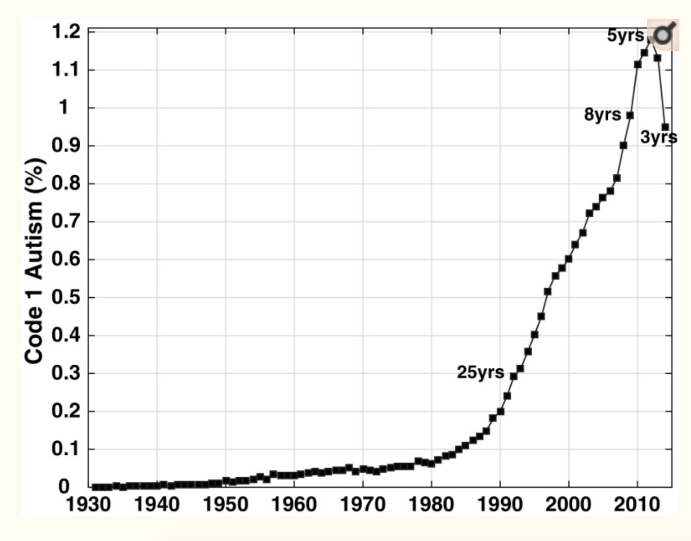

Vaccines have helped save millions of lives. In the 19th century, before herd immunization was achieved through vaccination programs, deaths from infectious diseases, like smallpox and polio, were common. However, today, despite all the scientific evidence for their importance, vaccination programs have become somewhat controversial.

The controversy started with a [paper](http://www.thelancet.com/journals/lancet/article/PIIS0140-6736(97)11096-0/abstract) published in 1988 and lead by [Andrew Wakefield](https://en.wikipedia.org/wiki/Andrew_Wakefield) claiming 
there was a link between the administration of the measles, mumps and rubella (MMR) vaccine, and the appearance of autism and bowel disease. 
Despite much science contradicting this finding, sensationalists media reports and fear mongering from conspiracy theorists, led parts of the public to believe that vaccines were harmful. Some parents stopped vaccinating their children. This dangerous practice can be potentially disastrous given that the Center for Disease Control and Prevention (CDC) estimates that vaccinations will prevent more than 21 million hospitalizations and 732,000 deaths among children born in the last 20 years (see [Benefits from Immunization during the Vaccines for Children Program Era — United States, 1994-2013, MMWR](https://www.cdc.gov/mmwr/preview/mmwrhtml/mm6316a4.htm)). 

Effective communication of data is a strong antidote to misinformation and fear mongering. In this homework you are going to prepare a report to have ready in case you need to help a family member, friend or acquaintance that is not aware of the positive impact vaccines have had for public health.

The data used for these plots were collected, organized and distributed by the [Tycho Project](http://www.tycho.pitt.edu/). They include weekly reported counts data for seven diseases from 1928 to 2011, from all fifty states. We include the yearly totals in the `dslabs` package:

```{r, warning=FALSE, message=F}
library(dslabs)
library(tidyverse)
library(pander)
library(gridExtra)
library(ggrepel)
library(RColorBrewer)
theme_update(plot.title = element_text(hjust = 0.5))
data(us_contagious_diseases)
```

1. Use the `us_contagious_disease` dataset and `dplyr` tools to create an object called `dat` that stores only the Measles data, includes a per 100,000 people rate, and removes Alaska and Hawaii since they only became states in the late 1950s. Note that there is a `weeks_reporting` column. Take that into account when computing the rate.

```{r}
dat = us_contagious_diseases %>% # Remove non-measles diseases, remove Alaska and Hawaii
  filter(disease == "Measles", !(state %in% c("Alaska", "Hawaii"))) %>% # Compute rate per 100,000 people
  mutate(rate = (count / weeks_reporting)*52 / (population/100000)) # multiply by 52 to get per year

```

2. Plot the Measles disease rate per year for California. Find out when the Measles vaccine was introduced and add a vertical line to the plot to show this year. Note: you should be using `ggplot2` for all plotting.

```{r}
ggplot(dat %>% filter(state == "California"), aes(year, rate)) + # Filter for California
  geom_point() + # Add point layer
  geom_vline(xintercept = 1963, color = "blue") + # Add vertical line for vaccine
  geom_text(aes(1980, 1000, label = "1963: Measles Vaccine Introduced")) +
  ggtitle("Measles Rates in California") + # Add labels
  ylab("Case Rate Per 100,000 People Per Year") +
  xlab("Year")
```

3. Note these rates start off as counts. For larger counts we can expect more variability. There are statistical explanations for this which we don't discuss here, but transforming the data might help stabilize the variability such that it is closer across levels. For 1950, 1960, and 1970, plot histograms of the rates across states with and without the square root transformation of the x-axis. Which seems to have more similar variability across years? Make sure to pick binwidths that result in informative plots. Note that you should create 6 histograms for this question.

```{r}

# Filter by year and have rate be x-axis. 
# Using histogram geom to make histogram and set title
# Repeat below but use Sqrt(rate) for x-axis
# Binwidth set to make plots more informative

ggplot(dat %>% filter(!is.na(rate), year %in% c(1950, 1960, 1970)), aes(rate)) + # Filter based on year
  geom_histogram() + # add histogram geom
  ggtitle("Measles Rates (US)") +
  xlab("Case Rate Per 100,000 People Per Year") + 
  facet_wrap(~year) # facet wrap on year 
  
  
ggplot(dat %>% filter(!is.na(rate), year %in% c(1950, 1960, 1970)), aes(rate)) + # Same as above
  geom_histogram(binwidth = 3) +
  ggtitle("Measles Rates (US)") +
  xlab("Case Rate Per 100,000 People Per Year (Square Root Scale)") +
  facet_wrap(~year) + 
  scale_x_sqrt() # Change scale to square root

```

&nbsp;

**It appears that 1950 and 1960 have similar variability regardless of whether you do the square root transformation or not. However, 1970 appears to have greater variability when you apply the square root transformation and compare it to the original scale. This is most likely due to the nature of the square root transformation and the insight that it can provide.**

&nbsp;

4. Plot the Measles disease rate per year for California. Use the square root transformation on the y-axis. Make sure that  **at least** the numbers $4,16,36, \dots, 100$ appear on the y-axis (you can have more numbers show on the axis). Find out when the Measles vaccine was introduced and add a vertical line to the plot to show this year.

```{r}
ggplot(dat %>% filter(state == "California"), aes(year, rate)) + # Filter only on California
  geom_point() +
  geom_vline(xintercept = 1963, color = "blue") + # Add line for introduction of vaccine
  geom_text(aes(1980, 1000, label = "1963: Measles Vaccine Introduced")) + # Add labels to plot
  ggtitle("Measles Rates in California") +
  ylab("Case Rate Per 100,000 People Per Year (Sqrt scale)") +
  xlab("Year") +
  scale_y_sqrt(breaks = seq(0, 100, by = 2)^2) # Make the square root scale and add breaks at specified values
  
```

&nbsp;

5. Now, this is just California. Does the pattern hold for other states? Use boxplots to get an idea of the distribution of rates for each year, and see if the pattern holds across states.

```{r}
ggplot(dat %>% filter(!is.na(rate)), aes(factor(year), rate)) + # Make year categorical variable and put on x-axis
  theme(axis.text.x = element_text(angle = 90, hjust = 1)) + # make axis labels vertical
  geom_boxplot() + # add boxplot geom
  xlab("Year") + # add labels
  ylab("Case Rate Per 100,000 People Per Year (Sqrt Scale)") +
  ggtitle("Measles Rates Over Time (US)") +
  scale_y_sqrt(breaks = seq(0, 100, by = 2)^2) + # Make the square root scale and add breaks at specified values
  geom_vline(xintercept = factor(1963), color = "blue") # Add line for introduction of vaccine
  

```

&nbsp;

**We see that the distribution of rates across states is roughly similar to that which we observed above for California. We see that the number of cases decreased on time went on, with a fast decline after the vaccine was introduced. So, this pattern does seem to hold across states.**

&nbsp;

6. One problem with the boxplot is that it does not let us see state-specific trends. Make a plot showing the trends for all states. Add the US average to the plot. The US average line is the average across states for each year. You will need to calculate this yourself, being careful to take into account state populations. There will be a different value for each year. Then, add the average trendline to your plot using a separate layer. Hint: Note there are missing values in the data.

```{r}
us_avg = dat %>% group_by(year) %>% filter(weeks_reporting > 0) %>% summarise(avg = sum(count/weeks_reporting)*52 / (sum(population)/100000))

ggplot(dat %>% filter(!is.na(rate)), aes(year, rate)) + # Remove missing values in data
  geom_line(aes(group = state)) + # have different lines for each state
  geom_vline(xintercept = 1963, color = "blue") +
  geom_text(aes(1983, 2500, label = "1963: Measles Vaccine Introduced")) + # Add labels to plot
  geom_line(data = us_avg, aes(year, avg, color = "US Average")) + # add US avg line
  theme(axis.text.x = element_text(angle = 90, hjust = 1)) + # make axis labels vertical
  scale_color_discrete("Trend") +
  xlab("Year") + # add labels
  ylab("Case Rate Per 100,000 People Per Year (Sqrt Scale)") +
  ggtitle("Measles Rates Per Year By State (US)") +
  scale_y_sqrt(breaks = seq(0, 100, by = 2)^2) # Make the square root scale and add
```

7. One problem with the plot above is that we can't distinguish states from each other. There are just too many. We have three variables to show: year, state and rate. If we use the two dimensions to show year and state then we need something other than vertical or horizontal position to show the rates. Try using color. Hint: Use the the geometry `geom_tile` to tile the plot with colors representing disease rates. 

```{r}
dat %>% ggplot(aes(year, state,  fill = rate)) + # add aes variables
        geom_tile(color = "grey50") + # add tile geom
        scale_x_continuous(expand = c(0,0)) +
        scale_fill_gradientn(colors = brewer.pal(9, "Reds"), trans = "sqrt") + # set color and scale
        geom_vline(xintercept = 1963, col = "blue") + # add year when vaccine introduced
        theme_minimal() + theme(panel.grid = element_blank()) +
        ggtitle("Measles Rates For Given States and Years (US)") + # set labels
        ylab("State") + 
        xlab("Year")

```


&nbsp;

8. The plots above provide strong evidence showing the benefits of vaccines: as vaccines were introduced, disease rates were reduced. But did autism increase? Find yearly reported autism rates data and provide a plot (please make your own plot using ggplot2) that shows if it has increased and if the increase coincides with the introduction of vaccines. Finding data for this question can be difficult. If you are able to find a plot of autism rates (even if for 1 state and not the entire U.S.) you can use that and estimate the values in the plot. **Be sure to cite your source(s)!**

&nbsp;


&nbsp;

_"Fig. 1 Age-resolved snapshot for 2017, showing the growth in California Department of Developmental Services (CDDS) Code 1 autism prevalence from 0.001% in birth year 1931 to 1.18% in birth year 2012."_

**Source:**\
Nevison C. et al. _California Autism Prevalence Trends from 1931 to 2014 and Comparison to National ASD Data from IDEA and ADDM_. J Autism Dev Disord. 2018. July 5.\

&nbsp;

**The plot I found shows the Autism rates in California from 1931 to 2012. The x-axis has the year, while the y-axis shows the percentage of the California population that is known to have Autism. It appears that after the introduction of the measles vaccine in 1963, there was an uptick in Autism prevalence that has steadily increased since. To estimate values in the plot, it looks like Autism prevalence was about 0.033% in 1963, then 0.05% in 1970, 0.2% in 1990, and almost 1.2% in 2012. Although the data may suggest that the vaccine led to this increase, there are many other factors to consider, including reporting, diagnosis, etc., that could be driving the Autism rate. In addition, this data only looks at California, so we do not know if this trend holds across the US.**\

**We will attempt to overlay the above graph over the California data for measles by converting the prevalence to case rate per 100,000 people per year:**

```{r}
autism = tibble(
  autism_years = c(1931, seq(1935, 2010, by = 5)),
  autism_percents = c(0, 0.00005, 0.0001, 0.00015, 0.0002, 0.0003, 
                      0.0004, 0.0005, 0.0006, 0.0007, 0.0008, 0.001, 0.002, 0.004, 0.006, 0.0078, 0.011) # add Autism data
)

autism = autism %>% mutate(rate_aut = autism_percents*100000) 

calif_measles = dat %>% filter(state == "California", year %in% autism[["autism_years"]]) # get same years for measles

ggplot(autism, aes(autism_years, rate_aut)) + # plot data together
  geom_point() +
  geom_line(aes(color = "Autism")) + # add geoms
  geom_point(data = calif_measles, aes(year, rate)) +
  geom_line(data = calif_measles, aes(year, rate, color = "Measles")) + # add measles information
  scale_color_discrete("Rate") + # add legend name
  xlab("Year") + # add labels
  ylab("Case Rate Per 100,000 People Per Year") + 
  ggtitle("Measles and Autism Rates in California") +
  geom_vline(xintercept = 1963) +
  geom_text(aes(1978, 700, label = "1963: Measles Vaccine Introduced"), size = 3) # Add vertical line
  

```


&nbsp;

9. Use data exploration to determine if other diseases (besides Measles) have enough data to explore the effects of vaccines. Prepare a report (minimum 1 paragraph, maximum 3 paragraphs) with as many plots as you think are necessary to provide a case for the benefit of vaccines. Note that there was a data entry mistake and the data for Polio and Pertussis are exactly the same. 

## Rubella Analysis

```{r}
Q9 = us_contagious_diseases %>% # Remove non-rubella diseases, remove Alaska and Hawaii
  filter(disease == "Rubella", !(state %in% c("Alaska", "Hawaii"))) %>% # Compute rate per 100,000 people
  mutate(rate = (count / weeks_reporting)*52 / (population/100000)) # multiply by 52 to get per year
```

```{r}
ggplot(Q9 %>% filter(!is.na(rate)), aes(year, rate)) + # Put year on x-axis
  theme(axis.text.x = element_text(angle = 90, hjust = 1)) + # make axis labels vertical
  geom_point() + # add point geom
  xlab("Year") + # add labels
  ylab("Case Rate Per 100,000 People Per Year") +
  ggtitle("Rubella Rates Over Time (US)") +
  geom_vline(xintercept = 1969) + # add vertical line for rubella vaccine
  geom_text(aes(1978, 600, label = "1969: Rubella Vaccine Introduced")) # Add label for line
  

us_avg2 = Q9 %>% group_by(year) %>% filter(weeks_reporting != 0) %>% summarise(avg = sum(count/weeks_reporting)*52 / (sum(population)/100000))

ggplot(Q9 %>% filter(!is.na(rate)), aes(year, rate)) + # Remove missing values in data
  geom_line(aes(group = state)) + # have different lines for each state
  geom_line(data = us_avg2, aes(year, avg, color = "US Average")) + # add US avg line
  theme(axis.text.x = element_text(angle = 90, hjust = 1)) + # make axis labels vertical
  geom_vline(xintercept = 1969, color = "blue") + # add vertical line for rubella vaccine
  geom_text(aes(1978, 600, label = "1969: Rubella Vaccine Introduced"),  color = "blue") + # Add label for line
  scale_color_discrete("Trend") +
  xlab("Year") + # add labels
  ylab("Case Rate Per 100,000 People Per Year (Sqrt Scale)") +
  ggtitle("Rubella Rates Per Year By State (US)") +
  scale_y_sqrt(breaks = seq(0, 100, by = 2)^2) # Make the square root scale and add breaks

```

&nbsp;

**Based on the _first_ plot above, it appears that there is evidence to suggest that the introduction of the rubella vaccine was pivotal in lowering the disease rate in the US. From the first recorded year on the graph to 1980, we see that the case rate per 100,000 people per year decreased from over 300 to near 0 across states. In particular, the US avg rate has been near zero since the 1980's. For the _second_ plot (line graph), although spikes of rubella have occurred since the vaccine became available, it is important to note that any subsequent peaks on the graph might not be a sign of the vaccine's ineffectiveness but rather the unwillingness of certain members of the population to get vaccinated. The fact that many major cities have become densely populated is also a reason that diseases like rubella can make a resurgence. Living in close proximity to others, especially to the elderly and those with weakened immune systems, allows diseases like rubella to spread quickly. It therefore is clear that gauging the vaccine's effectiveness requires additional insight that cannot be provided by the `us_contagious_diseases` dataset. The development of a vaccine must be paired with a conscious effort by people to practice good hygiene and maintain a clean living environment. Immunization is just one tool that cannot account for the myriad of other factors that contribute to disease transmission and poor public health.**


